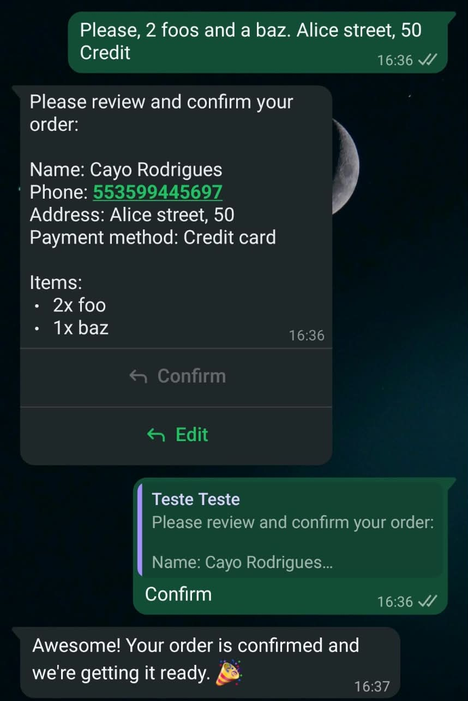

# WhatsApp Order Parser (POC)

This POC shows how to receive WhatsApp messages through the WhatsApp Cloud API (Meta), send them to an LLM (Anthropic Claude) for structured extraction, and reply with the parsed `DeliveryOrder` for confirmation. Treat it as an integration example. The same pattern works for AI chatbots, intent parsers, and conversational assistants.

You don't need a CNPJ or a verified business to try it out. Both are only required for production.

## Example

The customer sends a free-text order. The app extracts the fields, replies with a summary and **Confirm** / **Edit** buttons, and sends a confirmation message once the customer taps **Confirm**.

<details>
<summary>Show screenshot</summary>



</details>

## Prerequisites

- A Meta for Developers account (developers.facebook.com)
- An Anthropic (Claude) API key (or another LLM provider, with code changes)
- cloudflared or ngrok, to expose your local server over HTTPS

## Setup

1. Create an app on Meta: `developers.facebook.com/apps` → **Create App** → use case **"Connect with customers through WhatsApp"**.
2. In the app dashboard, click **Customize the Connect with customers through WhatsApp use case**.
3. Go to **Basic setup → Step 1. Try it out**. A test phone number is provisioned automatically.
4. Add your phone as a test recipient and complete verification with the code sent to WhatsApp.
5. Generate the `WHATSAPP_ACCESS_TOKEN`. It's temporary, so you'll need to regenerate it periodically.
6. Add the following to a `.env` file:

```dotenv
ANTHROPIC_API_KEY=...
WHATSAPP_ACCESS_TOKEN=...       # temporary token from Meta
WHATSAPP_VERIFY_TOKEN=...       # arbitrary shared secret you generate
PHONE_NUMBER_ID=...             # shown in Basic Setup → Step 1
WABA_ID=...                     # WhatsApp Business Account ID, also shown in Basic Setup → Step 1
```

> **Note:** `WHATSAPP_VERIFY_TOKEN` is not the access token. It's a shared secret used for the webhook verification handshake.

The verify token can be any random string. Here are two examples of how to generate one:

```bash
# OpenSSL
openssl rand -hex 32

# Python
python3 -c "import secrets; print(secrets.token_urlsafe(32))"
```

Copy the output into your `.env` file. You'll paste the same value into the Meta dashboard when you configure the webhook.

### Sending a test message from the dashboard

If you send a test message with the **Send message** button in the UI, you'll see this message:

> Message sent to {number}. Wait a minute for the message to appear. If not received, first send a WhatsApp message from the recipient phone to your business number to open a conversation window, then resend.

Make sure you follow that instruction. Also check the webhook request history on that page, which gives you valuable insight into what's happening.

## Run locally

1. Start the FastAPI server. Both commands load your `.env` file through `--env-file`:

   ```bash
   make dev
   # OR
   uv run --env-file .env fastapi dev
   ```

2. Expose it with cloudflared:

   ```bash
   cloudflared tunnel --url http://localhost:8000
   ```

3. Copy the generated public URL (e.g., `https://xxxx.trycloudflare.com`).

4. Configure the webhook in the Meta dashboard. Go to **Basic Setup → Step 2. Production setup → Configure Webhooks** (you can also get there by clicking **Continue** at the bottom of the Step 1 page), then fill in:
   - **Callback URL**: `https://xxxx.trycloudflare.com/webhook` (include `/webhook`, not just the base URL)
   - **Verify Token**: the value of `WHATSAPP_VERIFY_TOKEN` (the secret you generated; it can be any string)
   - **Webhook fields**: subscribe to `messages`. Meta may subscribe you to the most common events automatically, and those include `messages`.

5. Click _Verify and save_.

### Critical step: subscribe the app to your WABA

Configuring the webhook in the UI is not enough. You must also subscribe the app to your WABA through the Graph API:

```bash
curl -X POST "https://graph.facebook.com/v21.0/${WABA_ID}/subscribed_apps" \
  -H "Authorization: Bearer ${WHATSAPP_ACCESS_TOKEN}"
```

Expected response:

```json
{"success": true}
```

If you skip this step, real messages won't be delivered, even though the dashboard's test event succeeds. This is the "shadow delivery" gotcha.

This example uses `v21.0`. Check the Meta docs for the latest Graph API version.

## Webhook endpoints

Meta talks to this app through a single URL, `/webhook`, using two different HTTP methods.

### `GET /webhook`: verification handshake

When you click _Verify and save_ in the Meta dashboard, Meta sends a one-time `GET` request with three query parameters:

- `hub.mode`: always `subscribe`
- `hub.verify_token`: the value you typed into the dashboard
- `hub.challenge`: a random string

The endpoint compares `hub.verify_token` with your `WHATSAPP_VERIFY_TOKEN`. If it matches, it echoes `hub.challenge` back as plain text. Otherwise it returns `403`.

This step matters because Meta will not deliver any messages to a URL that hasn't passed it. It proves that you control the endpoint, and it stops anyone from pointing Meta's webhooks at a server they don't own. If the dashboard says it couldn't verify the callback URL, check these first:

- The `WHATSAPP_VERIFY_TOKEN` in your `.env` matches the dashboard exactly.
- The callback URL ends in `/webhook`.
- The server and the tunnel are both running.

### `POST /webhook`: incoming events

After verification, Meta sends every event (new messages, delivery statuses, etc.) as a `POST` with a JSON payload. At a high level, the endpoint does the following:

1. Walks through `entry[].changes[].value` in the payload, which is how Meta batches events.
2. Reads the sender's profile name from `contacts` and each message from `messages`.
3. Routes each message by its `type`:
   - `text`: sends the text to Claude, which extracts a `DeliveryOrder`. The app then replies with the parsed order and two buttons, **Confirm** and **Edit**.
   - `interactive`: a button press. `order_confirm` sends a confirmation message, and `order_fix` asks the customer to send the corrected details.
4. Returns `200 OK`.

Other message types and non-message events, such as delivery statuses, are ignored, but they still get a `200`.

Things to keep in mind:

- Meta retries deliveries that don't get a `2xx` response quickly. In this POC the LLM call happens before the response is returned, so a slow call can cause duplicate deliveries. For production, acknowledge first, process in a background task, and deduplicate by message ID.
- The POC doesn't validate the `X-Hub-Signature-256` header, so anyone who knows the URL can post fake events. Verify it with your app secret before going to production.

## Test

Send a WhatsApp message to the test number. Your server log should show the parsed output:

```text
[wa_id] 'message content' -> DeliveryOrder(...)
```

## Known issues and gotchas

- **Error 130497** (`"Business account is restricted from messaging users in this country"`): Meta restricts outbound messages from the business account in some countries. Inbound messages from users are unaffected. Once the conversation window is open, you can ignore this error.
- **`wa_id` normalization**: Meta may format phone numbers differently by region, so treat `wa_id` as canonical.
- **cloudflared quick tunnels are ephemeral**: the URL changes on every restart. For stable testing, use a named tunnel or ngrok with a reserved domain.
